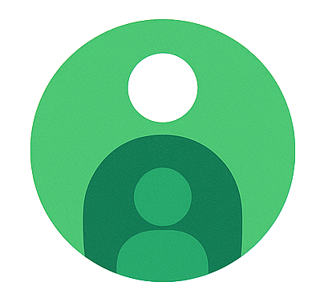

  
  
  <h1 align="center">Identis</h1>
  
  

    The identity and user management service responsible for handling user lifecycle operations, authentication data, identity resolution, and related metadata across the platform.
  

## Why "Identis"?

The name Identis is a stylized, Latinate form of the word identity, inspired by other services in our ecosystem like Vaulta, Quore, and Custos. It evokes the concept of personal identity and uniqueness in a way that feels both modern and timeless. Like its sibling services, the name is concise, expressive, and designed to signal purpose without being overly literal.
